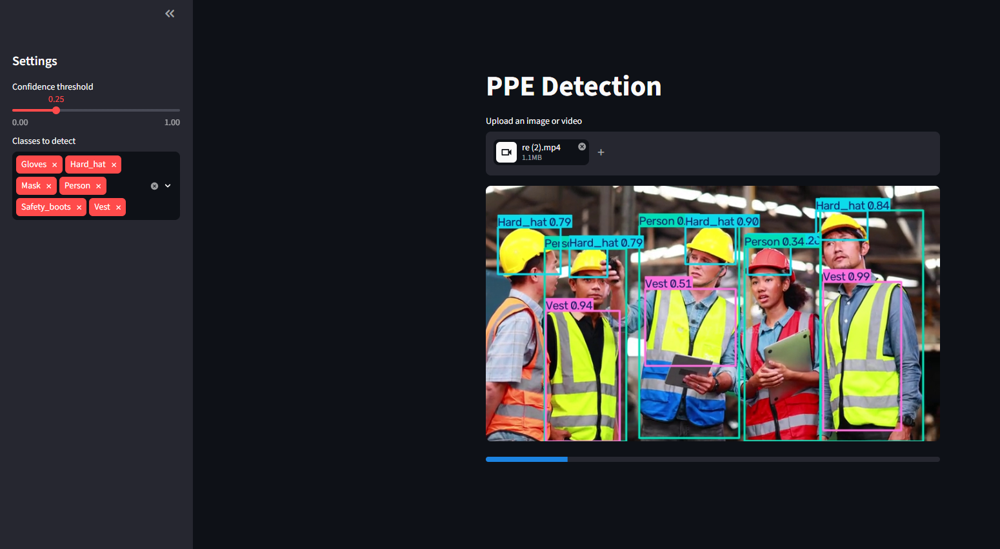

# PPE Detection

A simple Streamlit web app for detecting Personal Protective Equipment (PPE) in images and videos using a custom-trained YOLO model.

## Demo

🔗 **[Try it live here](https://ppe-detection-app1.streamlit.app/)**




## Features

- Upload an image or video for detection
- YOLO model (`yolo_weights/ppe.pt`) detects 6 classes: `Gloves`, `Hard_hat`, `Mask`, `Person`, `Safety_boots`, `Vest`
- Sidebar controls for confidence threshold and class filtering
- Live annotated preview for both images and videos
- Download the annotated image or video after detection

## Tech Stack

- **Frontend/App:** Streamlit
- **Model:** YOLO (Ultralytics)
- **Image/Video Processing:** OpenCV

## Requirements

- Python 3.x
- streamlit
- ultralytics
- opencv-python

## Installation

1. Clone the repository
   ```bash
   git clone https://github.com/farhankhoso/ppe-detection.git
   cd ppe-detection
   ```

2. Create a virtual environment (optional but recommended)
   ```bash
   python -m venv venv
   source venv/bin/activate   # On Windows: venv\Scripts\activate
   ```

3. Install dependencies
   ```bash
   pip install -r requirements.txt
   ```

## Usage

```bash
streamlit run app.py
```

Upload an image or video, adjust the confidence threshold and class filter in the sidebar, and download the annotated result.

## Project Structure

```
ppe-detection/
├── app.py                 # Main Streamlit app
├── yolo_weights/
│   └── ppe.pt              # Trained YOLO model weights
├── requirements.txt
└── README.md
```

## Model Classes

| Class        | Description              |
|--------------|---------------------------|
| Gloves       | Protective gloves         |
| Hard_hat     | Safety helmet              |
| Mask         | Face mask                  |
| Person       | Detected person             |
| Safety_boots | Protective footwear         |
| Vest         | Safety vest                |

## License

This project is licensed under the MIT License.

## Author

**Your Name**
[GitHub](https://github.com/farhankhoso) • [LinkedIn](https://www.linkedin.com/in/farhankhoso1)
